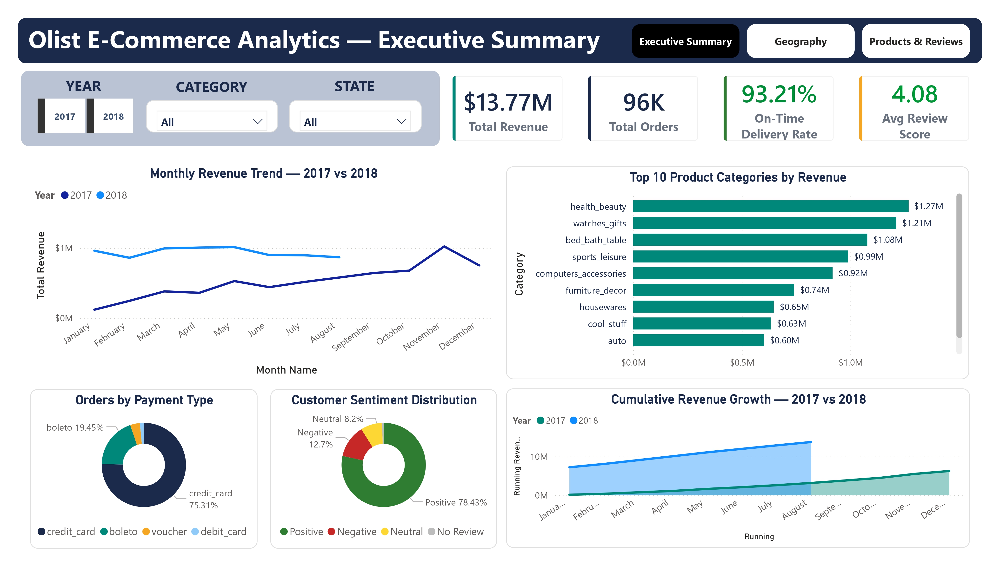
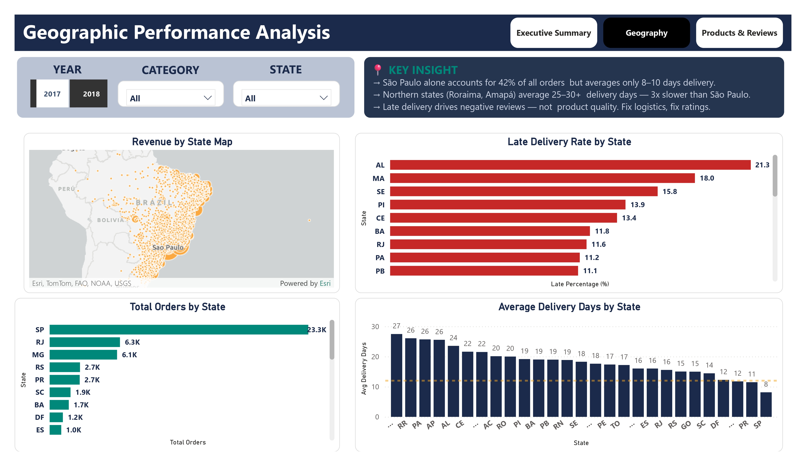
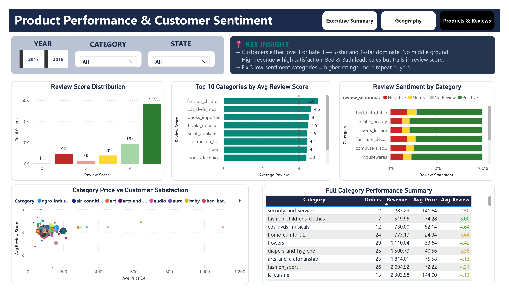
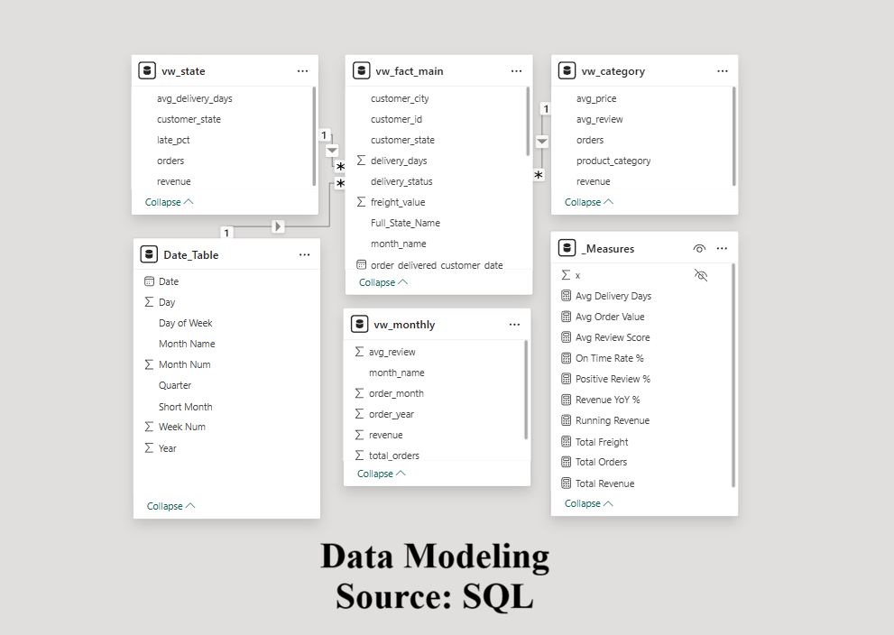

# Olist E-Commerce Operations Dashboard
### Microsoft Certified Data Analyst | Power BI · MySQL · DAX · Power Query


---

## The Business Problem

Olist — Brazil's largest e-commerce marketplace — operated
across 9 relational tables covering orders, customers, sellers,
products, payments, and reviews. The business had no unified
view of performance. Revenue trends, delivery reliability,
customer satisfaction, and regional gaps all existed in
fragments across disconnected data.

This project builds a single source of truth across all
dimensions — and finds where the real problems are hiding.

---

## Key Findings

| Finding | Number |
|---|---|
| Total Revenue | $13.77M across 2017–2018 |
| Total Delivered Orders | 96,000+ orders |
| On-Time Delivery Rate | 93.21% platform-wide |
| Avg Review Score | 4.08 / 5.0 |
| São Paulo order share | 23,300 orders — 42% of all orders |
| Worst state delivery | Roraima — 27 avg delivery days |
| SP vs North delivery gap | 8 days (SP) vs 27 days (RR) — 3x slower |
| Top revenue category | Health & Beauty — $1.27M |
| Dominant payment method | Credit card — 75.31% of all orders |
| Positive sentiment rate | 78.43% of all reviewed orders |

---

## The 3 Business Insights

**Page 1 — Executive Summary**
> $13.77M revenue, 93.21% on-time delivery, 4.08 avg
> review score. 2018 revenue dramatically outpaced 2017
> — cumulative growth visible in the running revenue chart.
> Credit card dominates at 75.31%. Positive sentiment at
> 78.43% — but 12.7% negative is worth investigating.

**Page 2 — Geography**
> São Paulo alone drives 42% of all orders but averages
> only 8 delivery days. Northern states (Roraima, Amapá,
> Pará) average 25–27 days — 3x slower. AL has the highest
> late delivery rate at 21.3%. Late delivery — not product
> quality — is the primary driver of negative reviews.
> Fix logistics in 5 northern states, fix platform ratings.

**Page 3 — Products & Reviews**
> Customers either love it or hate it — 5-star (57K) and
> 1-star (9K) dominate with little middle ground. High
> revenue does not equal high satisfaction — Bed & Bath
> leads revenue but trails in review score. Fashion
> Children's Clothes scores a perfect 5.0 avg review.

---

## Dashboard Pages

**Page 1 — Executive Summary**
4 KPI cards · Monthly revenue trend 2017 vs 2018 ·
Top 10 categories by revenue · Payment type donut ·
Sentiment donut · Cumulative running revenue area chart

**Page 2 — Geographic Performance Analysis**
Revenue by state filled map · Late delivery rate by state ·
Avg delivery days by state · Total orders by state ·
Key insight box

**Page 3 — Product Performance & Customer Sentiment**
Review score distribution · Top 10 categories by avg
review score · Review sentiment stacked bar by category ·
Category price vs satisfaction scatter · Full category
performance summary table

---

## Dashboard Screenshots

### Page 1 — Executive Summary


### Page 2 — Geographic Performance


### Page 3 — Products & Reviews


### Data Model


---

## Data Model

5 tables connected in Power BI:

| Table | Type | Description |
|---|---|---|
| vw_fact_main | Fact | 96K+ orders — core transaction data |
| vw_monthly | Aggregate | Monthly revenue and review summary |
| vw_category | Aggregate | Category revenue, price, review |
| vw_state | Aggregate | State orders, revenue, delivery |
| Date_Table | Dimension | Full date table with Year/Month/Quarter |

---

## Workflow
```
9 CSV Files (Olist Raw Data)
        ↓
Power Query — Clean, merge, translate
categories, create delivery_status,
delivery_days, review_sentiment columns
        ↓
MySQL — fact_olist table + 4 SQL views
(vw_fact_main, vw_monthly,
vw_category, vw_state)
        ↓
Power BI — Connect to MySQL views directly
        ↓
DAX — 10 custom measures
        ↓
3-Page Interactive Dashboard
```

---

## DAX Measures
```
Total Revenue =
SUM(vw_fact_main[price])

Total Orders =
DISTINCTCOUNT(vw_fact_main[order_id])

Total Freight =
SUM(vw_fact_main[freight_value])

Avg Order Value =
DIVIDE([Total Revenue], [Total Orders], 0)

Avg Review Score =
CALCULATE(
    AVERAGE(vw_fact_main[review_score]),
    vw_fact_main[review_score] > 0
)

On Time Rate % =
DIVIDE(
    CALCULATE([Total Orders],
        vw_fact_main[delivery_status] = "On Time"),
    [Total Orders], 0
) * 100

Avg Delivery Days =
AVERAGE(vw_fact_main[delivery_days])

Positive Review % =
DIVIDE(
    CALCULATE([Total Orders],
        vw_fact_main[review_sentiment] = "Positive"),
    CALCULATE([Total Orders],
        vw_fact_main[review_sentiment] <> "No Review"),
    0
) * 100

Revenue YoY % =
VAR cur  = [Total Revenue]
VAR prev = CALCULATE([Total Revenue],
    SAMEPERIODLASTYEAR(Date_Table[Date]))
RETURN DIVIDE(cur - prev, prev, 0) * 100

Running Revenue =
CALCULATE(
    [Total Revenue],
    FILTER(
        ALL(Date_Table[Date]),
        Date_Table[Date] <= MAX(Date_Table[Date])
    )
)
```

---

## Repository Structure
```
olist-ecommerce-analytics/
│
├── screenshots/
│   ├── page1_executive_summary.png
│   ├── page2_geography.png
│   ├── page3_products_reviews.png
│   └── data_model.png
│
├── sql/
│   └── olist_analysis.sql
│
├── pbix/
│   └── Olist_Analytics_Dashboard.pbix
│
├── data/
│   └── dataset_source.txt
│
└── README.md
```

---

## Dataset

Brazilian E-Commerce Public Dataset by Olist
Source: kaggle.com/datasets/olistbr/brazilian-ecommerce
Files: 9 CSV tables · 100,000+ orders · 2016–2018
Missing values after cleaning: 0

---

## Tools Used

- **Power Query** — Data cleaning, multi-table merging,
  category translation, derived columns
- **MySQL** — 8 analytical queries, 4 views
- **Power BI** — 3-page interactive dashboard,
  navigation, slicers, conditional formatting
- **DAX** — 10 custom measures

---

## About

Built by Shaharier Shourov
Microsoft Certified Data Analyst
Upwork: https://www.upwork.com/freelancers/shourov
LinkedIn: (https://www.linkedin.com/in/shaharier--shourov/)
